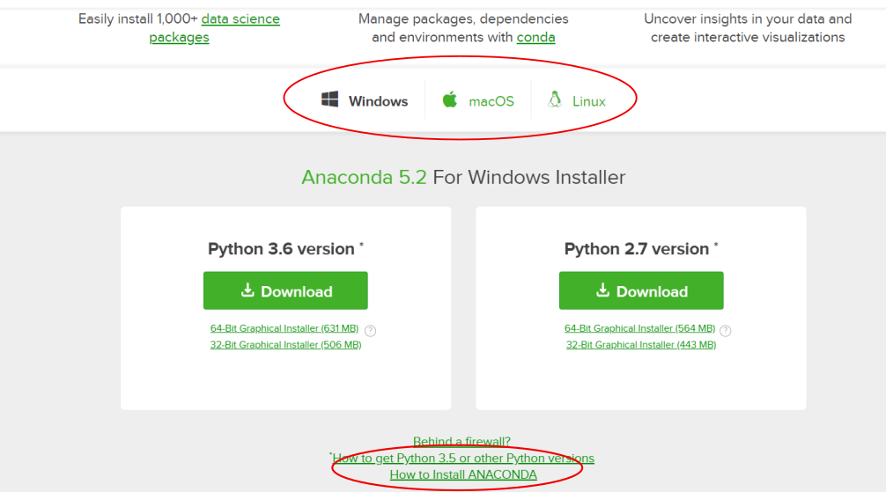

Python es un lenguaje de **programación libre de propósito general** que es utilizado por una comunidad muy amplia de usuarios. A pesar de ser un lenguaje genérico, son muchos los módulos que hoy en día se han desarrollado para poder ser utilizados dentro de el campo de Big Data y por ese motivo su utilización tendrá un lugar destacado dentro de las exposiciones que se harán en todo este sitio web.

Todo lo que necesitas saber sobre esta herramienta de programación la puedes encontrar en [https://www.python.org/](https://www.python.org/){:target="_blank"}. como puedes ver en este enlace, existe una opción en el menú principal denominada "Downloads" que te va a permitir bajar e instalar las herramientas necesarias para poder trabajar y programar en Python. No obstante en párrafos siguientes te mostraremos otro herramienta mejor para su instalación que se llama **Anaconda**.

En el menú principal de la página web de Python, existen otras dos opciones muy interesantes:

* [Docs](https://docs.python.org/3/){:target="_blank"}: Donde puedes encontrar todos los elementos de programación de este lenguaje.

* [PyPi](https://pypi.org/){:target="_blank"}: Donde puedes encontrar todos o la mayor parte de los módulos disponibles para poder ser utilizados por Python.

Como ya se ha dicho anteriormente para una instalación más cómoda de Python y otras herramientas complementarias, existe la opción de utilizar [anaconda](https://anaconda.org/){:target="_blank"}.

Si  vas al enlace indicado anteriormente, puedes ver en el menú principal una opción denominada "Download Anaconda". Si haces clic en esa opción te llevará a otra pantalla donde puedes elegir la versión de Anaconda que desees ( para Windows, para maasOS o bien para Linux): 

Igualmente se puede elegir entre la versión de Python 2.7 o la 3.6 ( aunque después, podrás crear diferentes "environments", mediante los cuales puedes trabajar con las diferentes versiones Python).

En la anterior imagen también se ha destacado el enlace donde puedes elegir la opción de cómo hacer la instalación en el ordenador. Gracias  a esta herramienta puedes ver de una forma clara los pasos que debes seguir para realizar una correcta instalación de Anaconda. La instalación es muy fácil y una vez la hayas completado podrás disponer de una serie de herramientas muy útiles en el campo de Big Data y python. Entre estas herramientas merece la pena destacar dos:

* **Jupyter Notebook**. Como su nombre indica es un  block de notas, pero muy potente, en el cual vas a poder escribir en formato Markdown y al mismo tiempo código de Python.

* **Spyder**. Es otra herramienta de programación de Python similar a la que se utiliza con "Rstudio" y que te sirve para escribir programas en Python.

Escribir sobre la utilización de estas herramientas y el lenguaje Python nos llevaría montones de posts, y dado que no es el objetivo de este sitio web, no me voy a adentrar más en mostrar su uso, pero esi sí antes de terminar el presente post de presentación de Python, no puedo por menos que al menos hacer referencia a dos importantes componentes o librerías de Python que se utilizan mucho en el mundo del Big Data, estas dos componentes son las siguientes:

* [Pandas](https://pandas.pydata.org/){:target="_blank"}: Libreria que facilita mucho la operativa de elementos de datos.

* [NumPy](http://www.numpy.org/){:target="_blank"}: Libreria ampliamente utilizada en el campo de la computación dentro de las diversas librerías de Big Data Existentes. 

Como complemento de las dos librerías anteriores, también se puede hacer referencia a [SciPy](https://www.scipy.org/scipylib/index.html){:target="_blank"}, la cual tiene buena prestaciones dentro del mundo de la matemática. Mientras que para el campo de la estadística se puede destacar [scipy.stats](https://docs.scipy.org/doc/scipy/reference/tutorial/stats.html){:target="_blank"}.

De las librerías anteriores se hablará en futuros post's y el lector popdrá comprobar lo fácil que es su utilización y la potencialidad que esconde su utilización.

No se puede finalizar este post, sin antes hacer referencia a otra librería ampliamente utilizada en el campo de representación de datos dentro del mundo Python, me estoy refiriendo a la librería [Matplotlib](https://matplotlib.org/){:target="_blank"}, a la que sin lugar a dudas se le dedicará otro post en el futuro.

Una vez hecha la presentación de Python, me despido de tí hasta mi próximo post, que estará dedicado a la introducción a R y Rstudio. Hasta la próxima.

